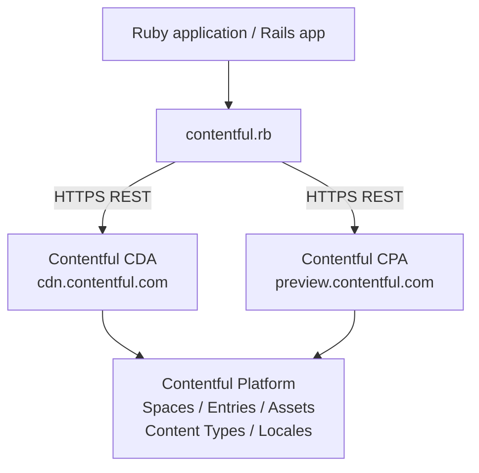

# Architecture

<!-- Generated by seed-golden-context | Last updated: 2026-05-05 -->

## Overview

`contentful.rb` is the official Ruby client for the [Contentful Content Delivery API (CDA)](https://www.contentful.com/developers/docs/references/content-delivery-api/) and [Content Preview API (CPA)](https://www.contentful.com/developers/docs/references/content-preview-api/). It is a read-only SDK — all write operations belong to `contentful-management.rb`. The library wraps REST API calls, maps JSON responses to typed Ruby objects, handles link resolution, supports localization, implements rate-limit retry logic, and provides a synchronization endpoint wrapper.

## System Context



**Upstream:** Any Ruby application (Rails, Sinatra, scripts) that needs to read content from Contentful.

**Downstream:** The library is a gem consumed by end-user Ruby apps. No Contentful-internal services depend on this library directly.

## Internal Structure

| File / Directory | Purpose |
|---|---|
| `lib/contentful.rb` | Entry point — requires `version`, `support`, `client` |
| `lib/contentful/client.rb` | Core client: configuration, HTTP dispatch, resource fetching, rate-limit retry, proxy support |
| `lib/contentful/resource_builder.rb` | Maps raw JSON API responses to typed Ruby resource objects |
| `lib/contentful/base_resource.rb` | Base class for all resources — hydrates `sys` properties, implements `marshal_dump/load`, equality |
| `lib/contentful/fields_resource.rb` | Subclass of `BaseResource` for resources with `fields` (Entry, Asset) — handles field hydration and localization |
| `lib/contentful/entry.rb` | Represents a CDA Entry — coerces fields using content type cache, resolves linked resources |
| `lib/contentful/asset.rb` | Represents a CDA Asset — file metadata and image URL helpers |
| `lib/contentful/content_type.rb` | Represents a CDA ContentType — drives field coercion via `ContentTypeCache` |
| `lib/contentful/content_type_cache.rb` | In-memory cache keyed by `space_id:content_type_id`; populated on client init when `dynamic_entries: :auto` |
| `lib/contentful/coercions.rb` | Type coercion strategies — String, Integer, Float, Boolean, Date, Location, Link, RichText, etc. |
| `lib/contentful/includes.rb` | Holds the includes array from an API response; used during link resolution |
| `lib/contentful/resource_references.rb` | Concern mixed into Entry — resolves `Link` objects to full resources from the includes pool |
| `lib/contentful/link.rb` | Lightweight representation of a Contentful link; can be `#resolve`d into a full resource |
| `lib/contentful/array.rb` | Wraps paginated API list responses; provides `#next_page`, `#next_page_url`, Enumerable |
| `lib/contentful/sync.rb` | Wrapper for the CDA Synchronization endpoint — iterates pages, tracks `next_sync_url` |
| `lib/contentful/sync_page.rb` | Single page of sync results |
| `lib/contentful/taxonomy_concept.rb` | Represents a Taxonomy Concept (SKOS-style) — added in v2.18 |
| `lib/contentful/taxonomy_concept_scheme.rb` | Represents a Taxonomy Concept Scheme — added in v2.18 |
| `lib/contentful/error.rb` | Error hierarchy keyed by HTTP status code (400, 401, 403, 404, 429, 500, 502, 503) |
| `lib/contentful/request.rb` | Builds and sends HTTP requests; constructs query strings and headers |
| `lib/contentful/response.rb` | Wraps raw HTTP responses; parses JSON, exposes status |
| `lib/contentful/support.rb` | Utility functions — `snakify`, `link?`, `link_array?`, `unresolvable?` |
| `lib/contentful/space.rb` | Represents a CDA Space resource |
| `lib/contentful/locale.rb` | Represents a Locale resource |
| `lib/contentful/location.rb` | Represents a geographic Location field value |
| `lib/contentful/file.rb` | Represents a File object within an Asset |
| `lib/contentful/field.rb` | Represents a ContentType Field — drives coercion dispatch |
| `lib/contentful/deleted_entry.rb` | Placeholder for sync-deleted entries |
| `lib/contentful/deleted_asset.rb` | Placeholder for sync-deleted assets |
| `lib/contentful/array_like.rb` | Module providing Array-like interface (`each`, `map`, `first`, etc.) |
| `lib/contentful/version.rb` | Gem version constant |
| `spec/` | RSpec test suite — unit tests per resource class, VCR fixtures for HTTP mocking |
| `spec/fixtures/` | VCR cassettes and JSON fixtures for HTTP response replay |
| `examples/` | Standalone Ruby scripts demonstrating library features |

## Data Flow

```
Client#entry(id) / Client#entries(query)
        │
        ▼
Request → HTTP GET https://cdn.contentful.com/spaces/{space}/environments/{env}/entries
        │
        ▼
Response → JSON parse → ResourceBuilder#run
        │
        ├─ JSON type == "Array"  →  Array wrapping item resources
        ├─ JSON type == "Entry"  →  Entry (via FieldsResource)
        │       │
        │       └─ includes pool built from response["includes"]
        │               │
        │               └─ Link fields resolved → nested Entry / Asset
        ├─ JSON type == "Asset"  →  Asset
        ├─ JSON type == "ContentType" → ContentType (cached in ContentTypeCache)
        └─ HTTP error status    →  Error subclass (keyed by status code)
```

**Field coercion path (dynamic entries):**
```
Entry field value
  └─ ContentTypeCache.cache_get(space_id, content_type_id)
       └─ Field#coerce(value, config) → typed Ruby value
            (String, Integer, Float, Boolean, DateTime, Location, Link, Array, RichText)
```

**Sync flow:**
```
Client#sync(initial: true) → Sync#first_page → SyncPage (items)
  └─ SyncPage#next_page (until Sync#completed?) → updates Sync#next_sync_url
```

## Domain Concepts

| Concept | Description |
|---|---|
| **Space** | Top-level container for all content (like a project). Identified by `space_id`. |
| **Environment** | A named branch within a Space (default: `master`). Added in v2.6. |
| **ContentType** | Schema definition — lists fields and their types. Drives field coercion. |
| **Entry** | A content record conforming to a ContentType. Has `sys` metadata + typed `fields`. |
| **Asset** | A binary file (image, PDF, etc.) with `sys` metadata and a `file` field. |
| **Link** | A lazy reference from one resource to another — resolved via the includes pool or a separate API call. |
| **Includes** | Array of pre-fetched linked resources bundled with an API response (up to `include` depth levels). |
| **Locale** | A language/region tag (e.g., `en-US`, `de-DE`). Each Entry can have fields for multiple locales. |
| **Sync** | Incremental content synchronization — returns all changed/deleted resources since a previous sync token. |
| **TaxonomyConcept** | A SKOS concept for hierarchical tagging. Added in v2.18 (late 2024). |
| **TaxonomyConceptScheme** | A collection of related TaxonomyConcepts. Added in v2.18. |

**Circular reference handling:** The `max_include_resolution_depth` (default: 20) prevents infinite recursion on cyclically linked content. `reuse_entries: true` is an alternative — it deduplicates hydrated objects but is incompatible with caching frameworks (can cause marshal errors).

## Key Dependencies

| Dependency | Why it's here | Notes |
|---|---|---|
| `http` (>0.8, <6.0) | HTTP client for all REST calls | Chosen over `net/http` for its clean API and feature-set (proxy, gzip, instrumentation hooks) |
| `multi_json` (~> 1.15) | JSON parsing adapter — delegates to the best available JSON library (`oj`, `yajl`, `json`) | Allows apps to swap JSON engines without gem changes |
| `rspec` (~> 3) | Test framework | Standard in Ruby ecosystem |
| `vcr` | Records/replays HTTP interactions in tests | Avoids live API calls in the test suite |
| `webmock` | HTTP stubbing for non-VCR tests | |
| `rubocop` (~> 1.60) | Style enforcement | Config in `.rubocop.yml` + `.rubocop_todo.yml` |
| `guard` + plugins | Watch-mode test runner | Runs RSpec, Rubocop, and YARD on file changes |
| `simplecov` | Coverage reporting | |
| `yard` | API documentation generation | Config in `.yardopts` |

## Configuration

All configuration is passed to `Contentful::Client.new(...)`. There are no environment variables read by the library itself — configuration is entirely code-driven.

| Option | Purpose | Default |
|---|---|---|
| `space` | Contentful Space ID (required) | — |
| `access_token` | CDA or CPA access token (required) | — |
| `environment` | Environment name | `'master'` |
| `api_url` | API hostname; set to `'preview.contentful.com'` for Preview API | `'cdn.contentful.com'` |
| `dynamic_entries` | `:auto` pre-fetches all content types on init; `:manual` disables auto-caching | `:manual` |
| `raise_errors` | Raise on API errors vs. return Error objects | `true` |
| `raise_for_empty_fields` | Raise `EmptyFieldError` or return `nil` for missing fields | `true` |
| `max_include_resolution_depth` | Prevents infinite recursion on circular linked content | `20` |
| `reuse_entries` | Deduplicate hydrated objects within a request (incompatible with caching) | `false` |
| `use_camel_case` | Use `camelCase` field accessors instead of `snake_case` | `false` |
| `max_rate_limit_retries` | Retry attempts after 429 (0 disables) | `1` |
| `max_rate_limit_wait` | Max seconds to wait between retries | `60` |
| `gzip_encoded` | Request gzip-encoded responses | `true` |
| `proxy_host` / `proxy_port` / `proxy_username` / `proxy_password` | Proxy configuration | `nil` |
| `timeout_read` / `timeout_write` / `timeout_connect` | HTTP timeouts in seconds | `nil` |
| `logger` | Pass a `::Logger`-compatible instance to enable request logging | `nil` |
| `log_level` | Log level for request logs (`::Logger::INFO` logs headers/params; `DEBUG` also logs raw JSON) | `::Logger::INFO` |
| `http_instrumenter` | Object implementing `HTTP::Features::Instrumentation::Instrumenter` for request monitoring | `nil` |
| `resource_mapping` | Override default resource classes with custom ones | `{}` |
| `entry_mapping` | Map content type IDs to custom Entry subclasses | `{}` |
| `application_name` / `application_version` | Included in `X-Contentful-User-Agent` header for analytics | `nil` |
| `integration_name` / `integration_version` | Same as above, for framework integrations (e.g., Rails) | `nil` |

## Operational Knowledge

### Deployment

This is a RubyGems library — "deployment" means releasing a new gem version.

**Release process** (sourced from Confluence Ruby SDK release guide):
1. Ensure all PRs are merged to `master` and tests are green
2. Update `lib/contentful/version.rb` with the new semver version
3. Add a version header in `CHANGELOG.md` and move unreleased content under it
4. Commit only those two files: `git commit -m "Bump to version X.Y.Z"`
5. Run `bundle exec rake release` — this pushes the commit, creates + pushes the version tag, and publishes to RubyGems
6. Rubydoc.info auto-generates docs on first visit to the new version URL

**There is no CD pipeline.** Releases are manual, triggered by the maintainer.

### Failure Modes

| Failure | Cause | What happens |
|---|---|---|
| `Contentful::Unauthorized` (401) | Invalid or expired access token | Raised immediately; no retry |
| `Contentful::RateLimitExceeded` (429) | Too many requests | Retried up to `max_rate_limit_retries` times, waiting `X-Contentful-RateLimit-Reset` seconds; blocks current thread |
| `Contentful::NotFound` (404) | Entry/asset doesn't exist | Raised (or returned if `raise_errors: false`) |
| Circular include resolution | Content model has circular links | Capped at `max_include_resolution_depth`; beyond cap, returns `Link` objects instead of resolved resources |
| `Contentful::Error` (500/502/503) | Contentful platform outage | Not retried by default; caller must handle |
| `EmptyFieldError` | Accessing a field not present in response | Raised if `raise_for_empty_fields: true`; return `nil` otherwise |
| Marshal errors with `reuse_entries: true` | Object graph has cycles; caching frameworks can hit stack errors | Disable `reuse_entries` when caching; lower `max_include_resolution_depth` |

### Monitoring

[NEEDS TEAM INPUT] — This is a client library with no server-side infrastructure. Monitoring is the responsibility of the consumer application. The catalog-info tier is `4` (lowest priority).

### Incident Playbook

[NEEDS TEAM INPUT] — For issues with the library itself, file a GitHub issue at `https://github.com/contentful/contentful.rb/issues`. For CDA outages affecting consumers, refer to Contentful's status page.
